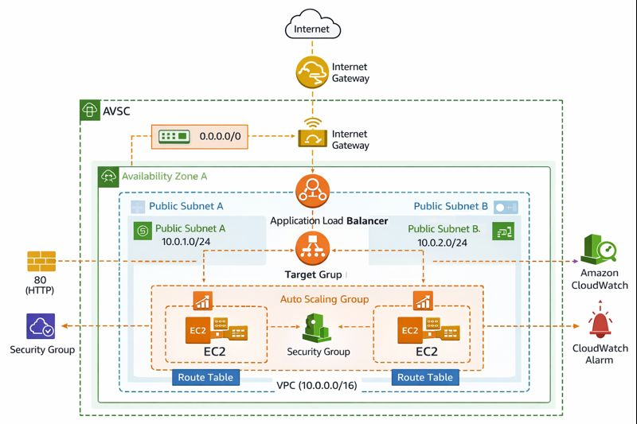
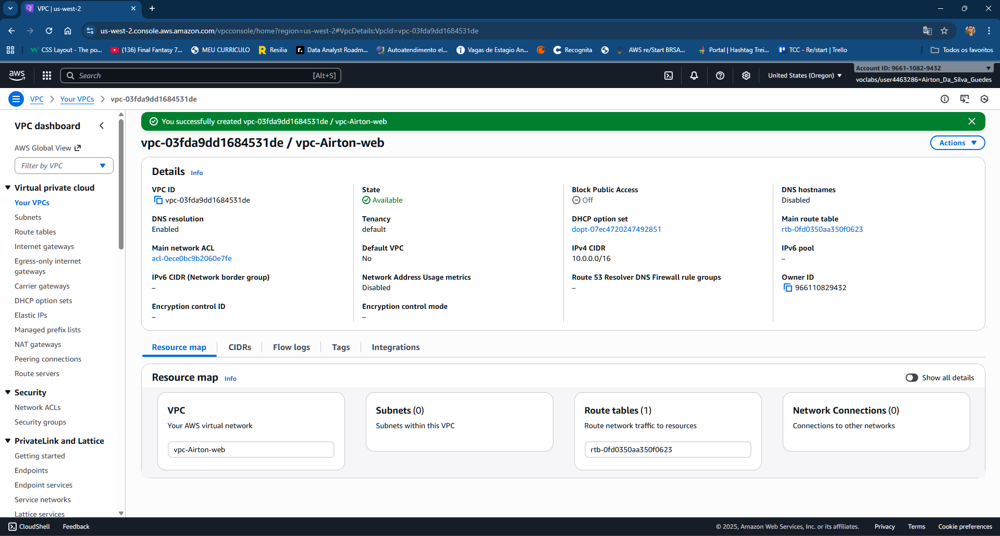
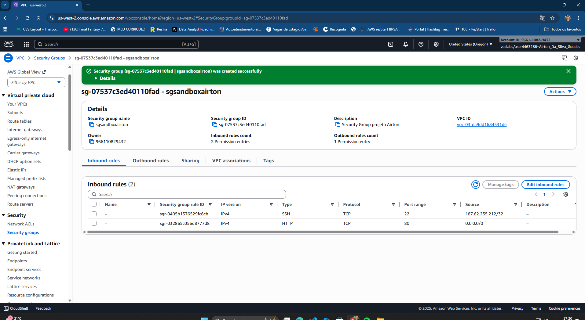
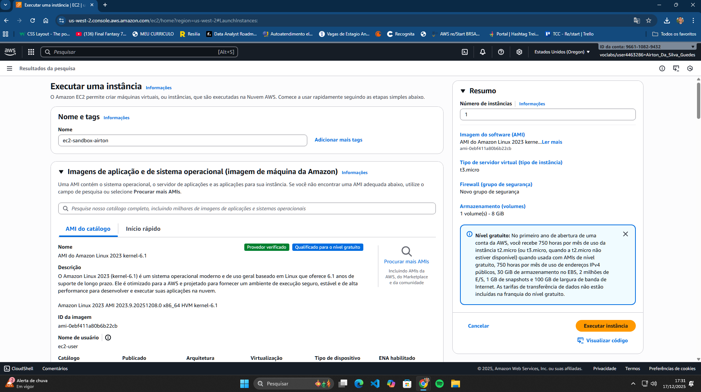
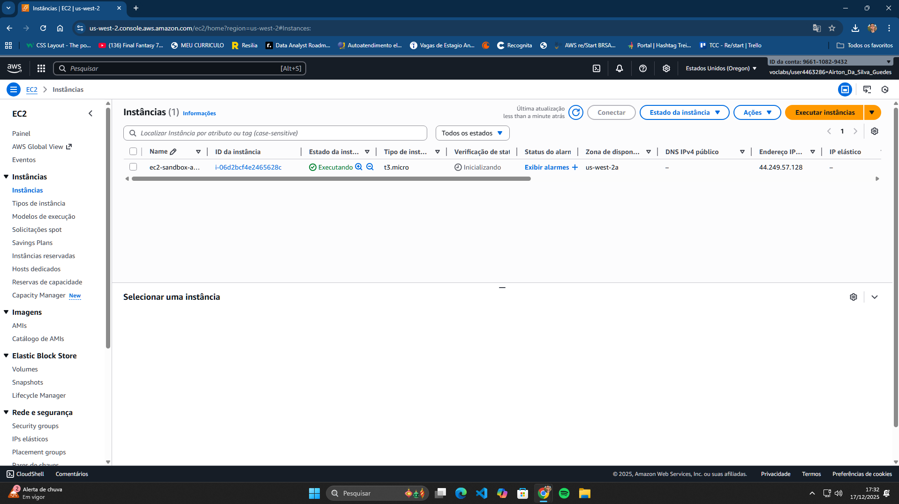
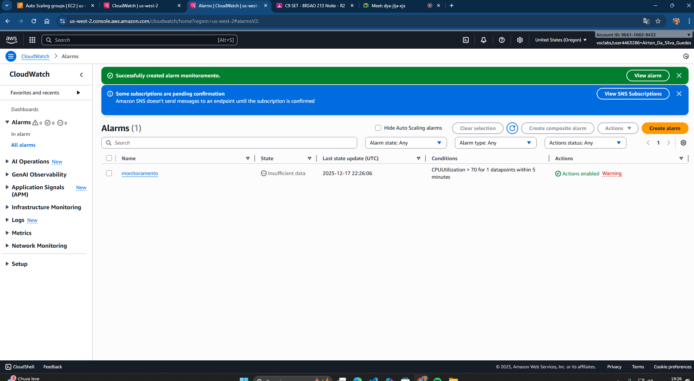

# Arquitetura Web Escalável e Altamente Disponível na AWS

Projeto prático de arquitetura web escalável na AWS, utilizando VPC customizada, subnets públicas em múltiplas Availability Zones, EC2, Application Load Balancer, Auto Scaling e CloudWatch.  
O foco foi alta disponibilidade, escalabilidade e monitoramento, com todos os recursos criados manualmente via AWS Management Console.

---
## 🗺️ Diagrama da Arquitetura

---

## 📌 Visão Geral
Este projeto demonstra a construção de uma arquitetura web escalável e altamente disponível na AWS, aplicando boas práticas de rede, segurança, balanceamento de carga, escalabilidade automática e monitoramento.

Todos os recursos foram criados manualmente com o objetivo de consolidar os fundamentos de computação em nuvem e arquitetura cloud.

---

## 🏗️ Serviços Utilizados
- Amazon VPC (customizada)
- Subnets públicas em múltiplas Availability Zones
- Internet Gateway
- Tabelas de Rotas
- Security Groups
- Amazon EC2
- Application Load Balancer (ALB)
- Target Group
- Auto Scaling Group
- Amazon CloudWatch

---

## 🌐 Rede e VPC

### Criação da VPC
Foi criada uma VPC customizada utilizando o bloco CIDR `10.0.0.0/16`, servindo como base para toda a infraestrutura de rede.

### Subnets
Foram criadas duas subnets públicas em diferentes zonas de disponibilidade (AZs), garantindo alta disponibilidade da aplicação.

### Internet Gateway e Roteamento
Um Internet Gateway foi associado à VPC e uma tabela de rotas foi configurada com a rota `0.0.0.0/0`, permitindo acesso à internet para os recursos públicos.

---

## 🔐 Segurança
Foi criado um Security Group com as seguintes regras:
- Acesso HTTP (porta 80) liberado para qualquer origem
- Acesso SSH (porta 22) restrito a um IP específico, aumentando a segurança administrativa

---

## 🖥️ Computação (EC2)
Foi provisionada uma instância Amazon EC2 utilizando:
- Amazon Linux 2023
- Tipo de instância `t3.micro`

Essa instância representa a aplicação web a ser acessada pelos usuários.

---

## ⚖️ Balanceamento de Carga
Foi configurado um Application Load Balancer (internet-facing) para distribuir o tráfego HTTP de forma automática entre as instâncias registradas.

---

## 🎯 Grupo de Destino (Target Group)
A instância EC2 foi registrada em um Target Group, com verificações de integridade (health checks) configuradas para garantir a disponibilidade da aplicação.

---

## 📈 Auto Scaling
Foi configurado um Auto Scaling Group com as seguintes características:
- Capacidade mínima: 1 instância
- Capacidade máxima: 3 instâncias
- Distribuição automática em múltiplas Availability Zones

Essa configuração permite que a aplicação escale automaticamente conforme a demanda.

---

## 📊 Monitoramento
Foi criado um alarme no Amazon CloudWatch para monitorar a utilização de CPU das instâncias EC2, acionando alertas quando o uso ultrapassar 70%.

---

## 🎯 Aprendizados
- Fundamentos de rede na AWS (VPC, Subnets e Roteamento)
- Implementação de alta disponibilidade com múltiplas AZs
- Balanceamento de carga com Application Load Balancer
- Escalabilidade automática com Auto Scaling
- Monitoramento e alertas com Amazon CloudWatch
- Organização e documentação de projetos cloud no GitHub

---

## 🚀 Próximos Passos
- Implementar HTTPS utilizando AWS Certificate Manager (ACM)
- Criar subnets privadas com NAT Gateway
- Automatizar a infraestrutura com Terraform ou CloudFormation

---

## 👤 Autor
**Airton da Silva Guedes**  
Estudante de Cloud Computing e Análise de Dados
